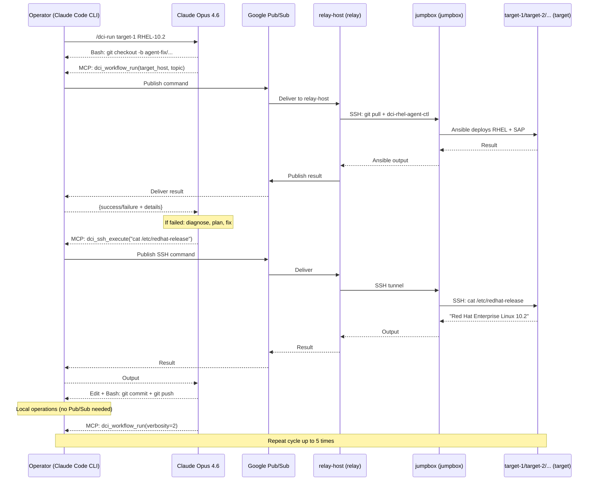

# Multi-Agent DCI Workflow

**Repository:** https://github.com/aisa-b/agentic-dci-workflow (private)
**ONLY push to this repository. Never push to any other remote or repository.**

## What This Project Does

An AI agent system (Claude Opus 4.6) that autonomously runs, diagnoses, and fixes
SAP HANA performance benchmarking pipelines on RHEL bare metal servers (HPE and Lenovo).
The main agent delegates to 4 specialized subagents and supports parallel runs
across multiple servers via independent Claude Code sessions.

## Architecture

5 machines/services in the chain:

1. **Operator machine** -- runs Claude Code CLI with MCP tools, local file/git ops, knowledge base.
2. **Google Cloud Pub/Sub** -- message bridge between networks (project `<your-gcp-project>`)
3. **relay-host (relay)** -- relay daemon, translates Pub/Sub messages to SSH commands
4. **jumpbox (jumpbox)** -- runs `dci-rhel-agent-ctl`, Ansible controller. Repo cloned at `/agentic-dci-workflow/`
5. **target servers** -- bare metal HPE and Lenovo SAP HANA servers being deployed/tested (gets redeployed each DCI run = new SSH host key every time). Multiple targets can run in parallel.



## Git Sync Flow (Code Synchronization Across Machines)

Code flows in one direction: the operator machine pushes to GitHub, everywhere else pulls.

```
Operator (Agent)             GitHub                 relay-host (Relay)           jumpbox (Jumpbox)
    |                          |                          |                            |
    |-- git push ------------->|                          |                            |
    |                          |                          |                            |
    |-- Pub/Sub: "run DCI" ----|------------------------->|                            |
    |                          |                          |-- SSH: git pull ---------->|
    |                          |                          |    (deploy key, read-only) |
    |                          |                          |-- SSH: dci-rhel-agent-ctl->|
    |                          |                          |    --hooks /dci-hooks_*    |
    |                          |                          |                            |-- runs Ansible
    |                          |                          |                            |-- deploys RHEL
    |                          |                          |                            |-- runs SAP prep
    |                          |                          |                            |-- runs benchmark
    |                          |                          |<-- result ----------------|
    |<-- Pub/Sub: result ------|--------------------------|                            |
    |                          |                          |                            |
    | (if failure: edit fix, commit, push, repeat)        |                            |
```

- **Operator machine**: The only machine that pushes to GitHub. Agent edits files locally, commits, pushes.
- **relay-host (relay)**: Pulls from GitHub on startup (`relay/start.sh`). Uses HTTPS + PAT.
- **jumpbox (jumpbox)**: Repo cloned at `/agentic-dci-workflow/`. Pulls from GitHub before each DCI run (`relay/handlers.py`). Uses SSH deploy key (read-only). Hooks are cloned from `jumpbox_hooks_dir` (run_config.yml) to `/agentic-dci-workflow/dci-hooks/` and pulled before each run.
- **Jumpbox deploy key**: Read-only by design. The jumpbox only consumes code, never produces it. Even if compromised, it cannot modify the repo.

## Claude Code Integration

Claude Code CLI is the primary orchestrator. It uses native tools (file, git, bash) plus MCP tools for remote operations.

**MCP tools** (via `dci-relay` server, configured in `.mcp.json`):
- `dci_preflight_check` — refresh Pub/Sub subscription, verify relay health, ping jumpbox. Call before every run.
- `dci_workflow_run` — trigger full DCI pipeline (OS deploy + SAP prep + benchmark + results). Up to 2h.
- `dci_workflow_status` — poll running workflow progress and results
- `dci_workflow_stop` — stop a specific running workflow by target hostname
- `dci_workflow_stop_all` — stop all running workflows
- `dci_workflow_list` — list all currently running workflows (enriched with heartbeat state and completions)
- `dci_fleet_status` — unified fleet dashboard: all workflows in one call with phase info, alerts, nr progress
- `dci_ssh_execute` — run a read-only command on the target server via SSH
- `dci_ssh_diagnostics` — run built-in diagnostic suite with focus area hint
- `dci_jumpbox_ping` — check relay/jumpbox connectivity
- `dci_jumpbox_execute` — run a command on the jumpbox (jumpbox) for process/log inspection
- `dci_relay_update` — pull latest code on relay machine and restart the daemon
- `dci_check_events` — check for workflow completion/failure events from the background Pub/Sub poller
- `dci_relay_health` — check relay infrastructure health (Pub/Sub connectivity, stats)
- `dci_server_profile` — capture and persist target server state to server_profiles.json

**Skills** (invoke with `/skill-name`):
- `/dci-configure --discover <hostname>` — one-time disk discovery for new servers (saves to disk_map)
- `/dci-configure show` — show the current disk_map and server status
- `/dci-run <hostname> [topic] [nr=N]` — full autonomous workflow: generate settings, show for review, run, diagnose, fix, retry (up to 5 attempts). Supports multiple jobs: `/dci-run target-1 RHEL-10.2 nr=3 /dci-run target-2 RHEL-10.3 nr=2`. Fleet monitoring via `dci_fleet_status()` shows all workflows in a unified dashboard.
- `/dci-fix <error>` — apply a single targeted fix based on a known error
- `/dci-report` — generate failure report PR, revert all changes

**Subagents** (delegate with "use the X subagent"):
- `dci-diagnostician` — exhaustive read-only diagnosis of failures (SRE perspective)
- `ansible-reviewer` — review Ansible changes for correctness before committing
- `hana-expert` — SAP HANA installation and runtime health assessment on the target server
- `os-deploy-expert` — Phase 1 OS deployment specialist (kickstart, PXE, partitioning, BIOS, BMC/iLO)

**Intent routing** -- what to use when:

| User wants to... | Use |
|---|---|
| Deploy OS + SAP HANA + benchmark on a server | `/dci-run <hostname>` |
| Deploy on multiple servers in parallel | `/dci-run <host1> ... /dci-run <host2> ...` |
| Add a new server to the fleet | `/dci-configure --discover <hostname>` |
| Apply a single known fix | `/dci-fix <error>` |
| Generate a failure report and revert | `/dci-report` |
| Diagnose a failure via SSH investigation | delegate to `dci-diagnostician` |
| Investigate SAP HANA install/runtime issues | delegate to `hana-expert` |
| Investigate PXE/kickstart/boot failures | delegate to `os-deploy-expert` |
| Review Ansible changes before committing | delegate to `ansible-reviewer` |

**Quick start**: run `claude` in the project root, then `/dci-run <hostname>` to start a full autonomous run. For parallel runs, use `claude agents` and dispatch each `/dci-run` as a separate session -- peek with `Space`, attach with `Enter`.

## Critical Rules

### NEVER delete code
- To disable something, COMMENT IT OUT with `#` prefix
- Always add `# [AGENT-DISABLED]` before commented-out blocks
- New code gets `# [AGENT-ADDED]` marker
- Deletion is done ONLY by the human

### NEVER access banned-host or /banned/path/
- **BANNED:** `banned-host.example.corp` and `banned-host` -- NEVER push, pull, or connect
- **BANNED:** `ssh://<jumpbox-user>@banned-host.example.corp/repo/dci-hooks` -- this is the old origin, NEVER use it
- **BANNED:** Everything under `/banned/path/` -- no modifications, no git operations
- The ONLY allowed jumpbox repo root is `/agentic-dci-workflow`
- The hooks are cloned to `/agentic-dci-workflow/dci-hooks/` from `jumpbox_hooks_dir` in run_config.yml
- The ONLY allowed settings dir is `/etc/dci-rhel-agent/`
- The ONLY allowed git remote is `origin` pointing to `github.com/aisa-b/agentic-dci-workflow`
- Enforced at relay level: commands containing `banned-host` or `/banned/path/` are hard-blocked

### Every change is a git commit AND a push AND a relay update
- Each fix attempt = one commit on an `agent-fix/<timestamp>` branch
- Each commit is pushed immediately (one push per change)
- **Every `git push` to the main repo MUST be immediately followed by `dci_relay_update()`** to pull the new code and restart the relay daemon. These two actions are ONE atomic operation -- never push without updating the relay.
- After relay update, call `dci_jumpbox_ping()` to verify the relay restarted successfully
- If relay update fails, report the failure and print recovery steps
- A PR is created on the first push; subsequent pushes update it
- Up to 5 fix attempts are tested automatically (no manual approval during the loop)
- If ALL attempts fail, ALL commits are reverted (new revert commits, no history rewriting)
- Partial fixes are not acceptable: either the workflow passes fully, or everything is rolled back

### Two-repo workflow (main repo + hooks repo)
The Ansible hooks (playbooks that run on the target) live in a **separate private
repo**, NOT in this repo. The hooks repo is configured in `run_config.yml`:

- `jumpbox_hooks_dir` -- git URL (used by the relay to clone/pull on the jumpbox)
- `local_hooks_dir` -- local path relative to this repo (where the agent edits hooks)

When fixing a hooks file (e.g., `config-variables.yml`, `user-tests.yml`, files under `dude/`):

1. Edit the file inside `local_hooks_dir` (e.g., `dci-hooks_cstate1_RHEL10_container_SELinux/`)
2. Commit and push **from inside that directory** (it's a separate git repo):
   ```
   cd <local_hooks_dir> && git add <file> && git commit -m "fix" && git push
   ```
3. Do NOT call `dci_relay_update()` -- the relay automatically does `git pull` on the
   hooks repo before each workflow run
4. Go back to the main repo root: `cd ..`

When fixing a file in the main repo (e.g., `relay/`, `agents/`, `tools/`):
- Commit and push from the main repo root as usual
- Follow with `dci_relay_update()` as normal

### NEVER add Co-authored-by to commits
- Cursor IDE may inject `Co-authored-by: Cursor <cursoragent@cursor.com>` via hooks
- ALWAYS strip this from commit messages
- If a hook re-adds it after amend, accept it -- the human will handle the hook

### Git push is ONLY to allowed repositories
- Main repo: `github.com/aisa-b/agentic-dci-workflow` (remote `origin`)
- Hooks repo: the repo configured in `jumpbox_hooks_dir` in `run_config.yml`
- NEVER push to any other repository, remote, or URL
- NEVER add new git remotes to either repo

### SSH is scoped to the target server only
- The agent can SSH into `DCI_TARGET_HOST` for investigation only
- It must NEVER access any other server
- Only read-only and reversible commands are allowed (allowlist enforced)

### NEVER modify credentials, project IDs, or infrastructure settings
- **NEVER** change GCP project IDs, service account key paths, Pub/Sub topic/subscription names, SSH key paths, passwords, hostnames, or any value in `.env`
- **NEVER** change `run_config.yml` fields: `pubsub_*`, `gcp_*`, `jumpbox_*`, `target_password`, `vertex_*` unless the human explicitly asks for that specific change
- **NEVER** change `agents/config.py` defaults for project IDs, topic names, subscription names, or credential paths
- These values are set once by the human and are permanently correct. If something isn't working, the problem is elsewhere -- diagnose, don't change credentials
- If you suspect a credential or project ID is wrong, ASK the human -- never fix it yourself

### GCP Project Split (NEVER mix these)
- `ANTHROPIC_VERTEX_PROJECT_ID` (`<your-vertex-project>`) -- Claude/Vertex AI ONLY
- `GCP_PUBSUB_PROJECT_ID` (`<your-gcp-project>`) -- Pub/Sub messaging ONLY
- Pub/Sub code never references the Vertex project
- Claude API code never references the Pub/Sub project

### ALWAYS update JIRA_TASKS.md
- `JIRA_TASKS.md` is a local file (gitignored) that tracks all work items
- After implementing a new feature, tool, subagent, skill, or infrastructure change: add a new ticket (or update an existing one from PLANNED/IN PROGRESS to DONE)
- After fixing a bug or improving an existing capability: update the relevant ticket's status and description
- Every PR or commit session that changes functionality MUST have a corresponding `JIRA_TASKS.md` update
- Keep the "Last updated" date and ticket counts at the bottom of the file current

### ALWAYS update documentation when code changes
- Every relevant code change triggers updates to: `JIRA_TASKS.md`, `CLAUDE.md` (if key files, tools, or skills changed), `SUBAGENT_GUIDE.md` (if agent definitions changed), and presentation generator (`tools/generate_technical_presentation.py`)
- After updating the presentation generator, regenerate the PPTX: `python3 tools/generate_technical_presentation.py`
- Documentation includes: architecture docs, design notes, the presentation, and agent/skill definitions
- If a change affects how the system works (new tool, new agent field, new workflow step), the documentation must reflect it in the same commit session

### ALWAYS verify CI passes before moving on
- Before pushing, run `ruff check agents/ tools/ tests/ relay/` and `pytest tests/ -q` locally
- If either fails, fix the errors before pushing -- do not push broken code
- After pushing, check CI status with `gh run list --limit 1`
- If CI fails, fix immediately -- do not move on to other tasks with a red CI
- Common CI failures: unused imports (F401), unused variables (F841), test assertions out of date

## The 5-Phase Workflow

### Phase 1 -- OS Deployment
Deploys a RHEL version onto a target bare metal server via DCI.
Runs from jumpbox (jumpbox). Uses `dci-rhel-agent-ctl` and Ansible hooks.
Target gets a fresh OS every time = new SSH host key. The relay auto-clears
stale host keys on both the relay machine and the jumpbox before each run.

### Phase 2 -- OS Prep for HANA
Configures the target for SAP HANA using `sap-preconfigure` Ansible roles.
Breaks most often on RHEL minor version upgrades due to role version mismatches,
missing packages, SELinux denials, tuned profile issues.

### Phase 3 -- HANA Installation
Installs SAP HANA database via hdblcm. Sets up disk volumes, creates the
SID user, deploys the HANA binaries, and starts the database instance.

### Phase 4 -- PBO Install and Run
Installs and runs the SAP HANA PBOffline benchmark. PBOffline lives on a
shared archive, not in this repo. Only the code around it (install, run,
evaluate) lives here.

### Phase 5 -- Results
Collects benchmark results and pushes them to the DCI backend.

## Key Files

### Configuration
- `run_config.yml` -- Single source of truth for all run settings (includes `disk_map` for server-to-disk mappings)
- `tools/configure_target.py` -- Generates per-hostname settings files and manages the disk_map
- `tools/sync_settings.py` -- Auto-sync: regenerate + commit + push settings before each workflow run

### Agent Layer (operator side)
- `agents/agent.py` -- System prompt (planning, progress, exploration)
- `agents/config.py` -- Config from run_config.yml + .env secrets
- `agents/hooks.py` -- Safety hooks (pre/post tool use)
- `agents/skill_api.py` -- Gate functions for /dci-run skill (triage, plan, fix loop enforcement)
- `agents/bridge/pubsub_client.py` -- Pub/Sub correlation-based RPC
- `agents/bridge/tools.py` -- 3 remote tool definitions
- `agents/bridge/usage_tracker.py` -- Free tier protection (hard block at 95%)
- `agents/local/file_tools.py` -- Local file read/edit/search
- `agents/local/git_tools.py` -- Local git operations
- `agents/local/knowledge_base.py` -- Persistent learning store
- `agents/local/run_journal.py` -- Per-run operational history (triage, diagnosis, plans, fixes, outcomes)
- `agents/local/relay_kb.py` -- Relay infrastructure issue tracking
- `agents/local/events.py` -- Unified telemetry (causal chains, error normalization, SHA-256 signatures, decision metrics)
- `agents/local/phase_expectations.py` -- 5-phase world model (expected state, adaptive timing from phase_timings.json)
- `agents/local/fix_loop.py` -- Fix attempt state machine (enforces triage→plan→fix→review gates)
- `agents/local/phase_timings.py` -- Phase transition tracking and timing helpers
- `agents/local/workflow_events.py` -- Workflow event queue (completion/stuck detection)
- `agents/local/fleet_state.py` -- Fleet goals (nr counters), completion history, persistence to fleet_state.json
- `agents/local/filelock.py` -- Atomic JSON writes (temp+rename) and fcntl-locked JSONL appends
- `agents/reference/os-deploy-knowledge.md` -- Domain knowledge reference for os-deploy-expert subagent
- `agents/mcp_server.py` -- FastMCP stdio server exposing 15 MCP tools to Claude Code
- `config_loader.py` -- Shared config module for agents/config.py and relay/config.py (DRY, unified env var handling)
- `tools/workflow_poller.py` -- Standalone poller: queries relay every 2min, writes phase/task status to JSON

### Relay Layer (Company B Linux machine)
- `relay/daemon.py` -- Pub/Sub subscriber + threaded dispatcher
- `relay/ssh_manager.py` -- Persistent SSH to jumpbox + two-hop to target
- `relay/handlers.py` -- Command handlers (workflow.run/list/stop/stop_all, ssh.execute/diagnostics, jumpbox.ping/execute, relay.update)
- `relay/safety.py` -- Destruction blocklist, regex injection detection, path restrictions, SSH allowlists (target + jumpbox), git branch safety, no-delete invariant, secret scrubbing, output wrapping

### Ansible Hooks (separate private repo, local path: `local_hooks_dir` in run_config.yml)
- `user-tests.yml` -- Main playbook chain
- `pre-run.yml` -- VM/guest pre-steps
- `config-variables.yml` -- Global defaults
- `dude/` -- Deploy types, storage, workloads, benchmarks
- `dude/benchmark/pbo/` -- PBOffline install/run/evaluate
- `dude/workload/saphana/` -- HANA installation
- `reporting/` -- DCI job tagging, result reporting
- `repos/` -- Repository configuration

### Documentation
- `SUMMARY.md` -- One-page project overview
- `GETTING_STARTED.md` -- Beginner guide from zero to running
- `SETUP_GUIDE.md` -- Detailed setup for each machine
- `DEEP_DIVE.md` -- Technical deep dive with upstream references
- `SETUP_LOG.md` -- Commands and decisions from setup session
- `RUNBOOK.md` -- Operations runbook (startup, monitoring, troubleshooting)
- `ARCHITECTURE.md` -- System architecture overview
- `DESIGN_NOTES.md` -- Design decisions and tradeoffs
- `JIRA_TASKS.md` -- Task tracker (local, gitignored)

## Container Deployment

The relay runs inside a Podman container on relay-host, NOT as a bare Python process.

- `container/Containerfile.relay` -- UBI9 Python 3.12 image for the relay daemon
- `container/relay.sh` -- Launcher script (start, stop, restart, update, logs)
- `container/entrypoint.sh` -- Container entry point (git credential setup, git pull, daemon start)

## LLM Backend

Model: Set via `model` in `run_config.yml` (falls back to `DCI_LLM_MODEL` in `.env`).
Region: `global` (REQUIRED by Red Hat policy -- do NOT use regional endpoints like us-east5.
Google charges a premium for regional endpoints. The global endpoint is covered by the
existing Vertex contract for data privacy).

## Configuration: Two Layers

All configuration is split into two layers:

### Layer 1: `run_config.yml` (in git -- single source of truth)

Everything that changes between runs: target server, RHEL topic, LLM model,
retry count, jumpbox paths, Pub/Sub topic names. Both the local agent and the
relay-host relay read this file. The relay gets updates via `git pull`
before each workflow run.

To switch targets: `python -m tools.configure_target generate target-5 RHEL-10.0`.
This generates `settings_current_target-5.yml`, updates `run_config.yml`, and both
machines pick it up via git. The `disk_map` table maps hostnames to install disk
identifiers (SCSI IDs or device names) — populated once per server via
`/dci-configure --discover`.

### Layer 2: `.env` (per-machine secrets, NOT in git)

Only machine-specific secrets that differ between the operator machine and relay-host:
- Operator: `ANTHROPIC_VERTEX_PROJECT_ID`, `GCP_PUBSUB_PROJECT_ID`
- Relay: `GOOGLE_APPLICATION_CREDENTIALS`, `JUMPBOX_SSH_KEY`, `GCP_PUBSUB_PROJECT_ID`

### Priority

`run_config.yml` wins over `.env` for any setting defined in both.
`.env` is only for secrets that cannot go in git.

### Settings files

Per-hostname settings files (`settings/settings_current_<hostname>.yml`) are
generated by `tools/configure_target.py` from the `disk_map` and server profiles
in `run_config.yml`. Multiple settings files can coexist for parallel runs.
The original `settings/settings_current_run.yml` is kept as the base template.

### Automatic Settings Sync

Every call to `dci_workflow_run()` automatically:
1. Regenerates the per-hostname settings file from `run_config.yml`
2. Commits and pushes if the file changed
3. The relay pulls, deploys the settings to `/etc/dci-rhel-agent/`, and starts the workflow

This guarantee holds regardless of how the workflow is triggered --
via `/dci-run`, direct MCP tool call, or subagent delegation.
If sync fails (missing disk_map, unknown server, git push error), the workflow does not start.
The relay also reloads `run_config.yml` after each git pull, and fails hard if the
settings file is missing or if git pull fails (no silent fallbacks).

### Disk Map and Per-Host Configuration

The `disk_map` in `run_config.yml` maps hostnames to stable SCSI IDs for install disks.
This is populated once per server via `/dci-configure --discover` and used for all
subsequent runs.

- `tools/configure_target.py` generates kickstart with `ignoredisk --only-use` (standard DCI format)
- Per-host HANA disk mappings in `setup.yml` and `config-variables.yml` use the `_host_disks[inventory_hostname]` pattern
- Known servers: target-1, target-3, target-2, target-4, target-5, target-6 (HPE), target-7, target-8 (Lenovo)

## Design Rationale

See `DESIGN_NOTES.md` for the full rationale behind every architectural decision
(17 sections with upstream references). Key decisions summarized here:

- **Opus over Sonnet**: multi-step reasoning for 2-hour workflows where retries are expensive
- **Direct API, no framework**: full control over safety hooks and tool dispatch
- **Pub/Sub bridge**: sub-second latency between separate networks, 10MB messages, pull delivery
- **Single orchestrator + 4 subagents**: sequential workflow, specialists for bounded tasks
- **Defense in depth**: safety split into advisory (operator-side) and structural (relay-side) tiers
- **Comment-out, never delete**: preserves original code for auditability and rollback

## Legacy Code (Removed)

The following files were removed from the repo (preserved in git history):
- `agents/orchestrator.py`, `agents/monitor_agent.py`, `agents/fix_agent.py` — Google ADK evaluation artifacts
- `run_agents.py` — direct Anthropic API agentic loop (kept locally, gitignored; 19 tools that duplicate Claude Code CLI functionality)

The single entry point is Claude Code CLI with `/dci-run`.
