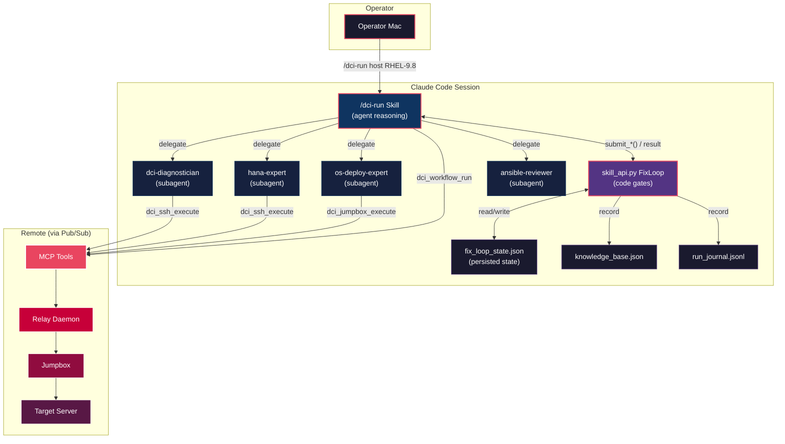
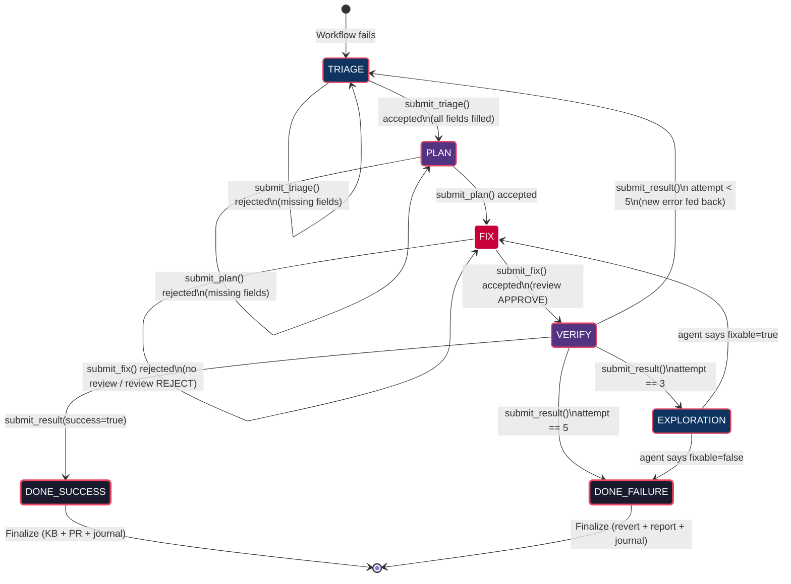
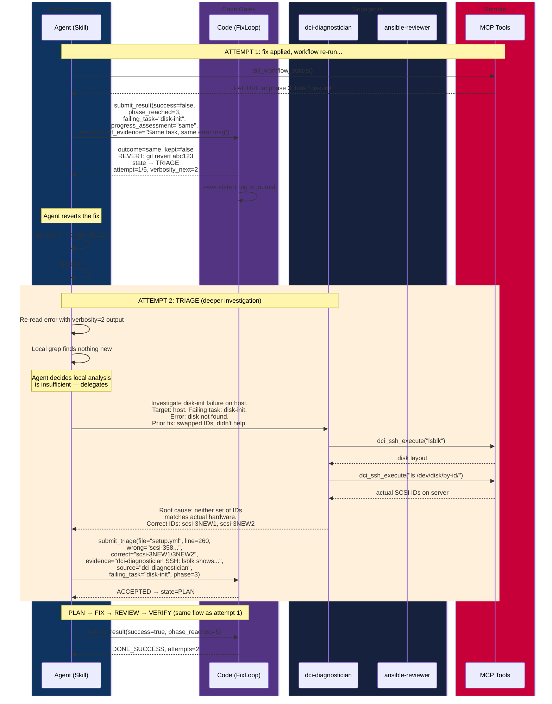
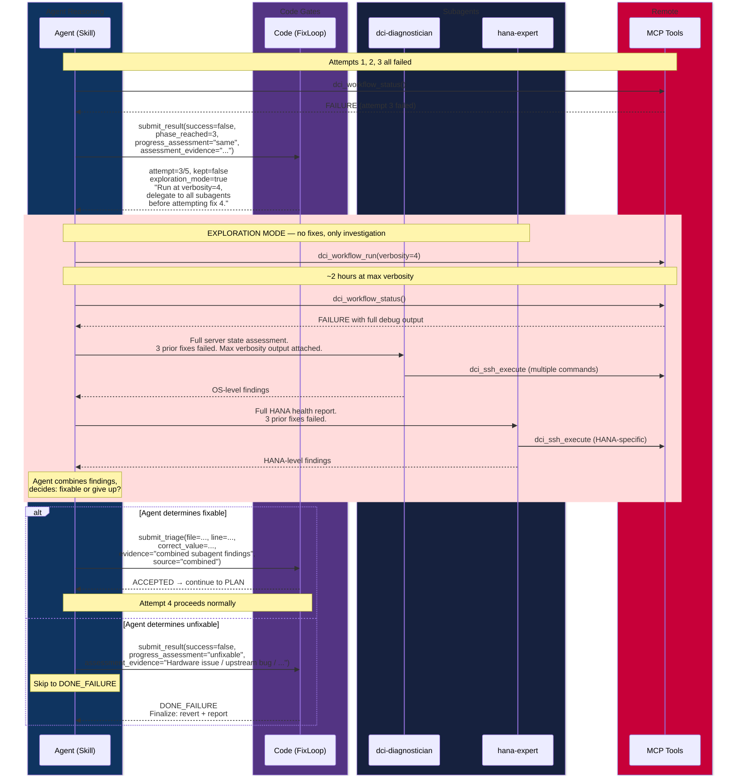
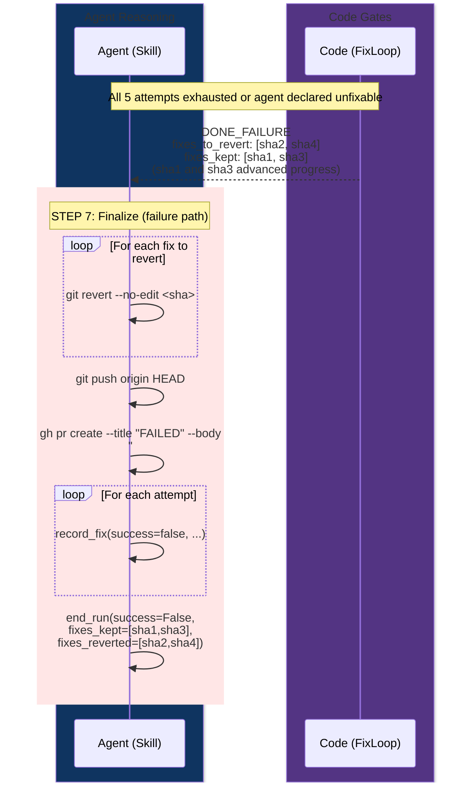
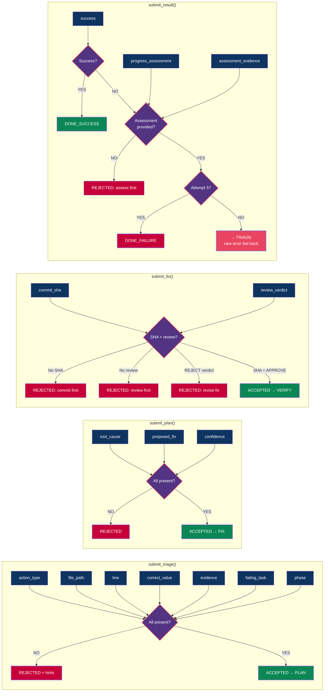
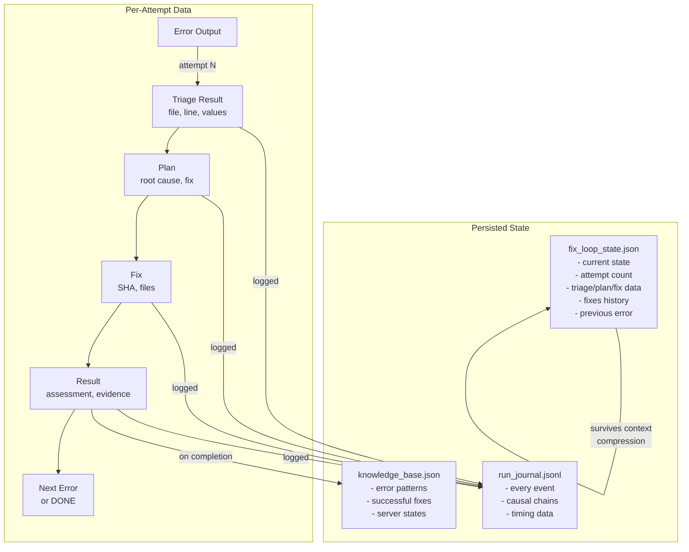

# Fix Loop Architecture — Agent ↔ Code Interaction

> **Status:** IMPLEMENTED. Gate functions in `agents/local/fix_loop.py`,
> PreToolUse hook in `.claude/hooks/enforce-step-order.sh`, configured
> in `.claude/settings.json`. Design principle: LLM decides intent,
> code enforces invariants.

## Overview

## State Machine

## Detailed Sequence — Attempt 1 (Full Happy Path)

```mermaid
sequenceDiagram
    box rgb(30, 30, 50) Operator Side
    participant OP as Operator
    end
    box rgb(15, 52, 96) Agent Reasoning
    participant SKILL as Agent (Skill)
    end
    box rgb(83, 52, 131) Code Gates
    participant GATES as Code (FixLoop)
    end
    box rgb(22, 33, 62) Subagents
    participant DIAG as dci-diagnostician
    participant HANA as hana-expert
    participant OSDEP as os-deploy-expert
    participant REV as ansible-reviewer
    end
    box rgb(199, 0, 57) Remote Infrastructure
    participant MCP as MCP Tools
    participant JB as Jumpbox
    end
    
    Note over OP,JB: WORKFLOW FAILS — entering fix loop
    
    OP->>SKILL: (no interaction — agent proceeds autonomously)
    
    rect rgb(30, 30, 50)
        Note over SKILL,GATES: STEP 2: Initialize
        SKILL->>SKILL: git checkout -b agent-fix/<timestamp>
        SKILL->>GATES: fix_loop(run_id, host, topic, error_output)
        GATES-->>SKILL: state=TRIAGE, attempt=0
    end
    
    rect rgb(15, 52, 96)
        Note over SKILL,JB: STEP 3: Triage (agent reasons freely)
        
        SKILL->>SKILL: Read error output, extract failing task
        SKILL->>SKILL: search_knowledge("error message")
        SKILL->>SKILL: grep -rn "error_value" dci-hooks/
        
        Note over SKILL: Agent finds file locally but<br/>doesn't know the correct value yet
        
        SKILL->>GATES: submit_triage(file="setup.yml", line=260,<br/>wrong="scsi-360...", correct="", ...)
        GATES-->>SKILL: REJECTED: missing correct_value<br/>Hint: read the file via cat on jumpbox
        
        Note over SKILL: Local analysis insufficient.<br/>Agent decides which subagent based on phase.
        
        alt Phase 1 failure
            SKILL->>OSDEP: Investigate OS deployment failure
            OSDEP->>MCP: dci_jumpbox_execute / dci_ssh_execute
            MCP-->>OSDEP: server state
            OSDEP-->>SKILL: findings + correct value
        else Phase 3-4 failure (HANA / benchmark)
            SKILL->>HANA: Investigate HANA failure
            HANA->>MCP: dci_ssh_execute (HANA-specific)
            MCP-->>HANA: HANA state
            HANA-->>SKILL: findings + correct value
        else Phase 2 or general failure
            SKILL->>DIAG: Investigate server state
            DIAG->>MCP: dci_ssh_execute / dci_ssh_diagnostics
            MCP-->>DIAG: diagnostics output
            DIAG-->>SKILL: findings + correct value
        else File content readable via jumpbox
            SKILL->>MCP: jumpbox_execute("cat setup.yml")
            MCP->>JB: cat setup.yml
            JB-->>MCP: file content
            MCP-->>SKILL: file content with correct value in comments
        end
        
        Note over SKILL: Agent now has all fields
        
        SKILL->>GATES: submit_triage(file="setup.yml", line=260,<br/>wrong="scsi-360...", correct="scsi-358...",<br/>evidence="from subagent/jumpbox cat",<br/>source="local_analysis | subagent name",<br/>failing_task="disk-init", phase=3)
        GATES-->>SKILL: ACCEPTED → state=PLAN
        GATES->>GATES: save state to fix_loop_state.json
    end
    
    rect rgb(83, 52, 131)
        Note over SKILL,GATES: STEP 4: Plan (agent reasons freely)
        
        SKILL->>SKILL: Formulate root cause, fix, confidence
        
        SKILL->>GATES: submit_plan(root_cause="other-server disk IDs active,<br/>target-server commented out",<br/>proposed_fix="swap comment lines",<br/>confidence="high",<br/>fallback="SSH to check actual disks",<br/>risk="low")
        GATES-->>SKILL: ACCEPTED → state=FIX<br/>file_to_edit=setup.yml, line=260
        GATES->>GATES: log_plan() to journal
    end
    
    rect rgb(88, 24, 69)
        Note over SKILL,REV: STEP 5: Fix + Review
        
        SKILL->>SKILL: Read file (cat from jumpbox if not local)
        SKILL->>SKILL: Write fixed version locally
        SKILL->>SKILL: git add + git commit
        
        Note over SKILL: Agent tries to submit without review
        
        SKILL->>GATES: submit_fix(sha="abc123",<br/>files=["setup.yml"],<br/>review_verdict="")
        GATES-->>SKILL: REJECTED: no review verdict.<br/>Delegate to ansible-reviewer first.
        
        SKILL->>REV: Review this change:<br/>setup.yml disk ID swap
        REV->>REV: Check YAML syntax, markers,<br/>variable refs, no-delete rule
        REV-->>SKILL: verdict=APPROVE
        
        SKILL->>GATES: submit_fix(sha="abc123",<br/>files=["setup.yml"],<br/>review_verdict="APPROVE")
        GATES-->>SKILL: ACCEPTED → state=VERIFY<br/>verbosity=0, attempt=1
        GATES->>GATES: log_fix_applied() to journal
    end
    
    rect rgb(144, 12, 63)
        Note over SKILL,JB: STEP 6: Push + Re-dispatch + Wait
        
        SKILL->>SKILL: git push -u origin HEAD
        SKILL->>SKILL: gh pr create (first attempt only)
        
        SKILL->>MCP: dci_workflow_run(verbosity=0, target=host)
        MCP->>JB: git pull + dci-rhel-agent-ctl
        
        Note over SKILL,JB: ~2 hours pass (agent monitors)
        
        SKILL->>MCP: dci_workflow_status(target=host)
        MCP-->>SKILL: status=completed, success=true
    end
    
    rect rgb(10, 135, 84)
        Note over SKILL,GATES: STEP 6c: Evaluate
        
        SKILL->>GATES: submit_result(success=true, phase_reached=5)
        GATES-->>SKILL: DONE_SUCCESS<br/>attempts=1<br/>next: "Finalize: record to KB,<br/>generate change report"
    end
    
    rect rgb(26, 26, 46)
        Note over SKILL,GATES: STEP 7: Finalize
        
        SKILL->>SKILL: record_fix() to KB
        SKILL->>SKILL: gh pr edit --body (change report)
        SKILL->>SKILL: end_run(success=True)
        SKILL-->>OP: Change report printed
    end
```

## Detailed Sequence — Attempt 1 Fails, Attempt 2 Succeeds

## Detailed Sequence — Exploration Mode (After 3 Failures)

## Detailed Sequence — Finalize on Failure

## Gate Validation Rules

## Data Flow

## Tool Access Per Actor

| Actor | Can Read | Can Write | Can Ask User | MCP Tools |
|-------|----------|-----------|-------------|-----------|
| Agent (main skill) | Read, Grep, Glob, Bash | Edit, Write, Bash(git) | YES (but gates discourage) | All MCP tools |
| dci-diagnostician | Read, Grep, Glob, Bash | NO | NO (structurally blocked) | dci_ssh_execute, dci_ssh_diagnostics, dci_jumpbox_execute |
| hana-expert | Read, Grep, Glob, Bash | NO | NO (structurally blocked) | dci_ssh_execute, dci_ssh_diagnostics |
| os-deploy-expert | Read, Grep, Glob, Bash, WebFetch | NO | NO (structurally blocked) | dci_ssh_execute, dci_ssh_diagnostics, dci_jumpbox_execute |
| ansible-reviewer | Read, Grep, Glob, Bash | NO | NO (structurally blocked) | None |
| Code (FixLoop) | fix_loop_state.json | fix_loop_state.json | NO (it's code) | None (agent makes MCP calls) |
